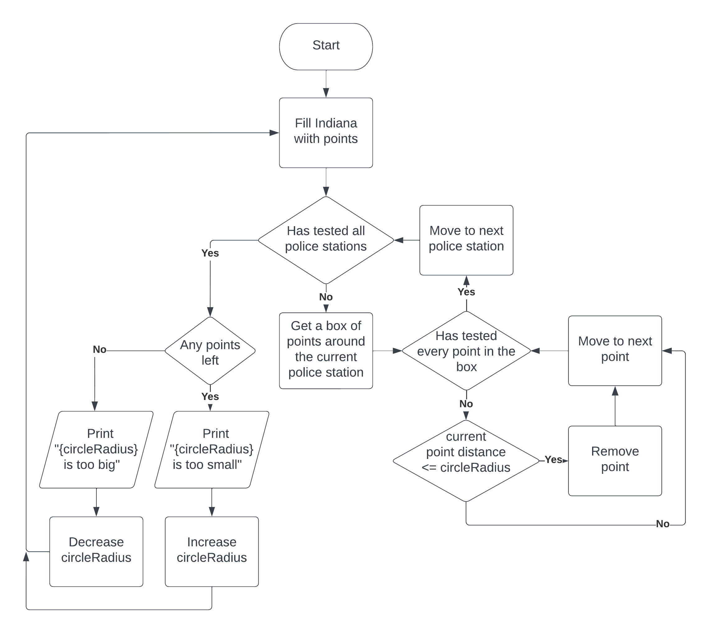
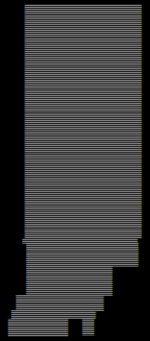

# Farthest-Distance-From-Indiana-Police-Stations

### Table of Contents  
1. [How the Program Works](#How-the-Program-Works)  
2. [Result](#Result)
3. [Usage](#Usage)
4. [Tools I Used](#Tools-I-Used)


## How the Program Works

The algorithm is stupid because I'm bad at coding, but basically I have an array of points across Indiana and it just draws a circle around each police station and sees if there are any points not inside of the circles. If there are any points not inside of the circles it will make the circles bigger and if all the points are inside of the circles it will make the circles smaller. The radius of the circles after a bunch of iterations is the farthest distance.

Here's a flowchart which goes into more detail about how the program works:



Also the array of points is scuffed because the Indiana border line on the south side of the state is blad, so it leaves out little pockets on the south side. This is what the point map looks like visually:




## Result

After a bunch of iterations with the points spaced 0.25 miles apart, I got:
"circle radius 16.6207513809204 is too small, point remaining at 38.097053527832, -86.5286331176758".
Therefore the radius of the circles probably has to be about 16 - 17 miles in order for all of Indiana to be covered.


## Usage

You can mess around with this program yourself by changing the MILES_BETWEEN_POINTS constant in constants.cpp and compiling it with
```sh
g++ -O3 -I "./Header Files" "Source Files/*.cpp" -o program
```


## Tools I Used

Police station locations source: https://koordinates.com/layer/108466-indiana-police-stations/data/

I used the Geocode google sheets plugin to convert the addresses to earth coordinates. Link to the plugin: https://workspace.google.com/marketplace/app/geocode_by_awesome_table/904124517349
